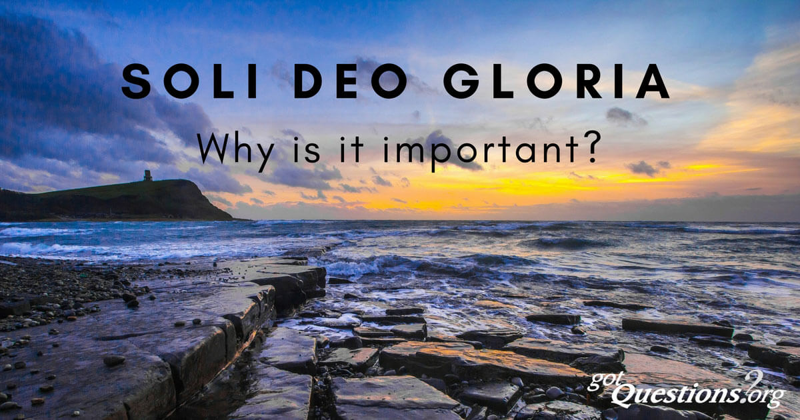

Draft: Bach and the concept of <abbr title="soli Deo gloria">SDG</abbr>---soli Deo gloria

> The German composer Johann Sebastian Bach (1685–1750) understood that music was a gift from God to be used for the glory of God. Beneath all of his compositions of sacred music, Bach penned the initials SDG, soli Deo gloria. In his vision of heaven, the apostle John saw “the twenty-four elders fall down before him who sits on the throne and worship him who lives for ever and ever. They lay their crowns before the throne and say: ‘You are worthy, our Lord and God, / to receive glory and honor and power’” (Revelation 4:10–11). Even the elders of heaven do not keep their crowns; they give glory where glory is due—to God alone

https://www.gotquestions.org/soli-Deo-gloria.html

<figure>

</figure>

https://upload.wikimedia.org/wikipedia/commons/a/ab/Soli_deo_gloria.jpg

soli-deo-gloria-PGW_620x.jpg

Five solae of the
Protestant Reformation:
* Sola scriptura
* Sola fide
* Sola gratia
* Solus Christus
* Soli Deo gloria
vte

Main facade of the Dominican Church in Lviv with the Latin phrase "Soli Deo honor et gloria".

> "Soli Deo gloria" inscripted in Norwegian cast-iron stove from the 19th century
> Soli Deo gloria is a Latin term for Glory to God alone. It has been used by artists like Johann Sebastian Bach, George Frideric Handel, and Christoph Graupner to signify that the work was produced for the sake of praising God. The phrase has become one of the five solae propounded to summarise the Reformers' basic beliefs during the Protestant Reformation.
> 
> As a greeting, it was used by monks in Cistercian and Trappist monastic orders in written communication.[1]
> 
> As a doctrine, it means that everything is done for God's glory to the exclusion of mankind's self-glorification and pride. Christians are to be motivated and inspired by God's glory and not their own.

https://en.wikipedia.org/wiki/Soli_Deo_gloria

https://info.thecrossingchurch.com/blog/three-letters-that-will-change-your-life

SDG-768x475.jpg

Three-Letters_Blog.jpg