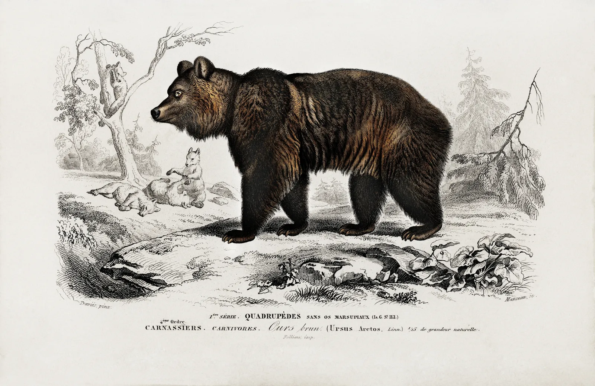

<p class="lead">Lead: Nullam quis risus ornare vel eu leo. Fusce dapibus, tellus ac cursus commodo, tortor mauris condimentum nibh, ut fermentum massa justo sit amet risus. Lorem ipsum dolor sit amet, consectetur adipiscing elit.</p>

<figure class="extend">

<figcaption>Figcaption: Aenean lacinia bibendum nulla sed consectetur.</figcaption>
</figure>

Donec sed odio dui. Donec ullamcorper _emphasis_ eget urna _bold text_ mollis **bolder text** nulla non metus auctor fringilla. Cras mattis consectetur purus sit amet fermentum. Etiam porta sem malesuada magna mollis [a link here](https://github.com/woocommerce/FlexSlider) euismod.

Donec sed odio dui. Donec ullamcorper^[A footnote inlined] nulla non metus auctor fringilla. Cras mattis consectetur purus sit amet fermentum. Etiam porta sem malesuada magna mollis euismod.

## Header two

Donec sed odio dui. Donec ullamcorper nulla non metus auctor fringilla. Cras mattis consectetur purus sit amet fermentum. Etiam porta sem malesuada magna mollis euismod.

### Header three

Integer posuere erat a ante venenatis dapibus posuere velit aliquet. Praesent commodo cursus magna, vel scelerisque nisl consectetur et. Donec sed odio dui. Etiam porta sem malesuada magna mollis euismod.

#### Header 4

Donec sed odio dui. Donec ullamcorper _emphasis_ eget urna _bold text_ mollis **bolder text** nulla non metus auctor fringilla. Cras mattis consectetur purus sit amet fermentum. Etiam porta sem malesuada magna mollis [a link here](https://github.com/woocommerce/FlexSlider) euismod.

Donec sed odio dui. Donec ullamcorper nulla non metus auctor fringilla. Cras mattis consectetur purus sit amet fermentum. Etiam porta sem malesuada magna mollis euismod.


###### Header six

Duis mollis, est non commodo luctus, nisi erat porttitor ligula, eget lacinia odio sem nec elit. Fusce dapibus, tellus ac cursus commodo, tortor mauris condimentum nibh, ut fermentum massa justo sit amet risus. Aenean eu leo quam. Pellentesque ornare sem lacinia quam venenatis vestibulum. Curabitur blandit tempus porttitor.

Paragraphs are separated by a blank line.

2nd paragraph. _Italic_, **bold**, and `monospace`. Itemized lists
look like:

- this one
- that one
- the other one

Note that --- not considering the asterisk --- the actual text
content starts at 4-columns in.

### Blockquote

> Block quotes are
> written like so.
>
> They can span multiple paragraphs,
> if you like.

Use 3 dashes --- for an em-dash. Use 2 dashes for ranges (ex., "it's all
in chapters 12--14"). Three dots... will be converted to an ellipsis.
Unicode is supported. ☺

## h2 header

Here's a numbered list:

1. first item
2. second item
3. third item

Note again how the actual text starts at 4 columns in (4 characters
from the left side). Here's a code sample.

As you probably guessed, indented 4 spaces. By the way, instead of
indenting the block, you can use delimited blocks, if you like:

```
define foobar() {
    print "Welcome to flavor country!";
}
```

Now a nested list:

- First, get these ingredients
  - carrots
  - celery
  - lentils
- Boil some water.
- Dump everything in the pot and follow
  - list1
  - asdasd
  - asdad

Notice again how text always lines up on 4-space indents (including
that last line which continues item 3 above).

## Footnotes

Here's a link to [a website](http://foo.bar). Here's a footnote^[A second footnote inlined] and text.

## Tables

Tables can look like this:

| Tables   |      Are      |  Cool |
| -------- | :-----------: | ----: |
| col 1 is | left-aligned  | $1600 |
| col 2 is |   centered    |   $12 |
| col 3 is | right-aligned |    $1 |

A horizontal rule follows:

---

and images can be specified like so:


Inline math equations go in like so: $\omega = d\phi / dt$. Display
math should get its own line and be put in in double-dollarsigns:

$$I = \int \rho R^{2} dV$$

And note that you can backslash-escape any punctuation characters
which you wish to be displayed literally, ex.: \`foo\`, \*bar\*, etc.
